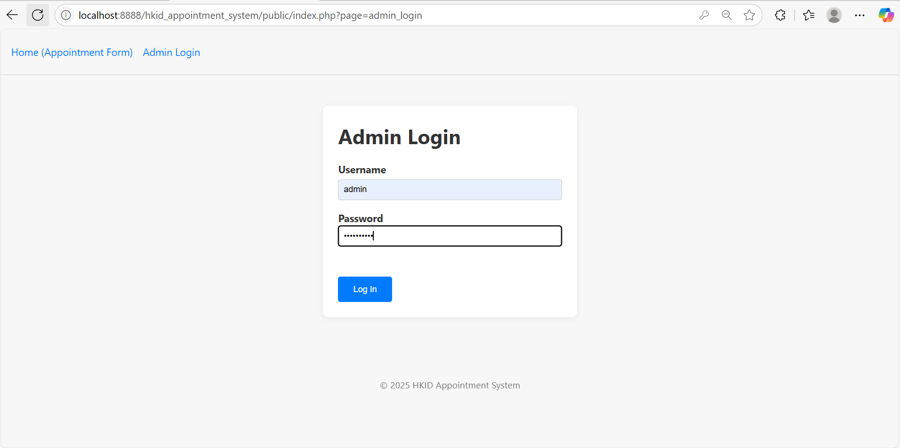
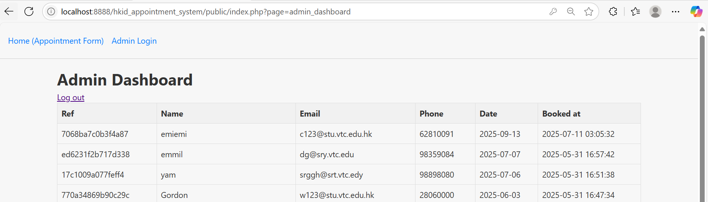
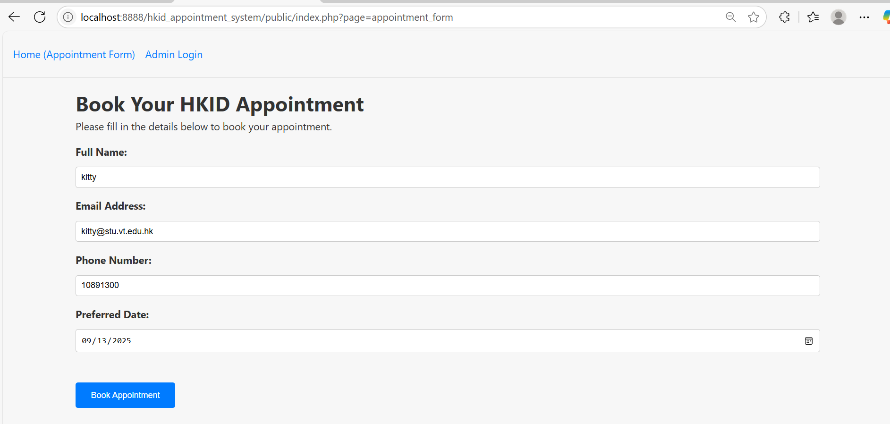
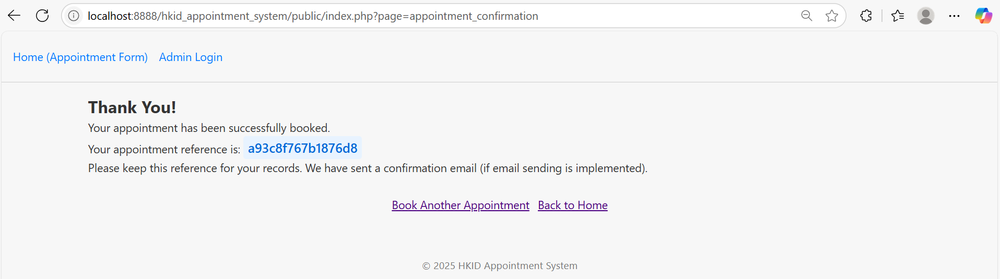

## 🚀 Local setup with MAMP

1. **Install MAMP**  
   - Download from <https://www.mamp.info/en/downloads/> and follow the installer.  
   - Keep the default ports: **Apache → 8888** and **MySQL → 8889**.  
   - 
then you can go to this localhost:http://localhost:8888/hkid_appointment_system/public/index.php?page=appointment_form
2. **Place the project in `htdocs`**

   C:\MAMP\htdocs\hkid_appointment_system
   
   the user name is `admin`, password is `secret123`, if it fail, you can go to setting to change it
   
   as a admin, you can see all registration
    
   if you are customer, you can make a booking
   
  if you booking sucessful, will show you nthis screen.
