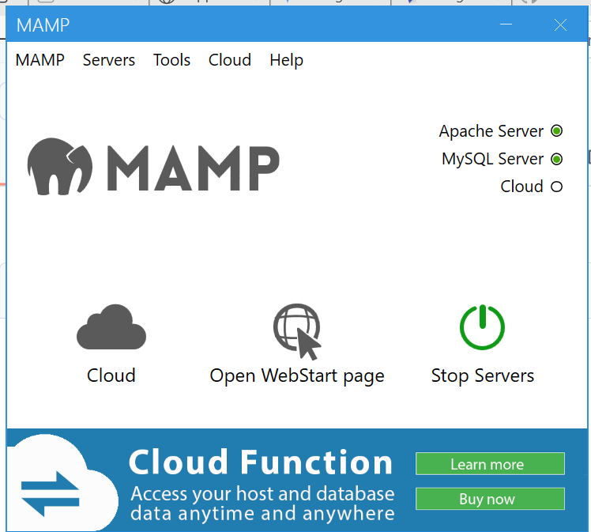

## 🚀 Local setup with MAMP

1. **Install MAMP**  
   - Download from <https://www.mamp.info/en/downloads/> and follow the installer.  
   - Keep the default ports: **Apache → 8888** and **MySQL → 8889**.  
   - 
http://localhost:8888/hkid_appointment_system/public/index.php?page=appointment_form
2. **Place the project in `htdocs`**

   ```text
   C:\MAMP\htdocs\hkid_appointment_system
   ├─ ThankYou_page
   ├─ book_HKID_page
   ├─ admin_dashboard
   └─ admin_login_page
